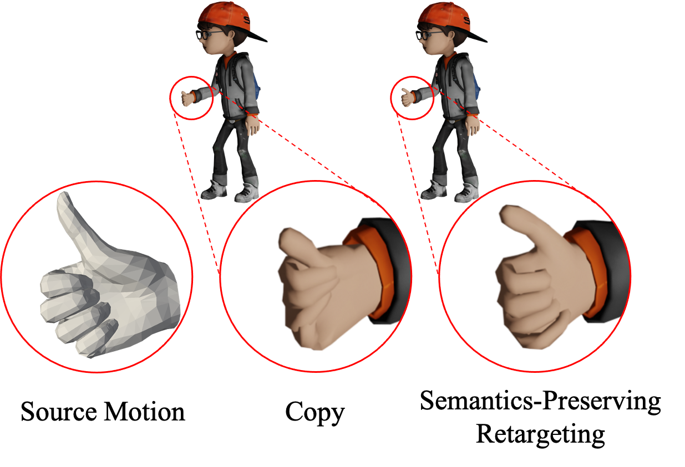

# Semantics2Hands


Official implementation for the paper **"Semantics2Hands: Transferring Hand Motion Semantics between Avatars"**.

<div style="text-align:center"></div>

## Getting Started

### 1. Create Conda Environment

```bash
conda create -n s2h python=3.8
conda activate s2h
```

The code was tested on Python 3.8, PyTorch 1.13.1 and CUDA 12.1.

### 2. Install Dependencies

Install packages from `requirements.txt`.
```bash
pip install -r requirements.txt
```

Install PyTorch3D. Following the official [instruction](https://github.com/facebookresearch/pytorch3d/blob/main/INSTALL.md) of PyTorch3D, you can install with
```bash
conda install -c fvcore -c iopath -c conda-forge fvcore iopath
pip install --no-index --no-cache-dir pytorch3d -f https://dl.fbaipublicfiles.com/pytorch3d/packaging/wheels/py38_cu113_pyt1121/download.html # Installing from prebuilt wheels is faster than using conda, but the prebuilt wheel url may differ depeding on your CUDA version.
```

The `chumpy` package required by `smplx` is no longer maintained and would raise ImportError. We need to comment line 11 in "CONDA_DIR/envs/s2h/lib/python3.8/site-packages/chumpy/__init__.py". `CONDA_DIR` is the directory where you install conda.
```python
from numpy import bool, int, float, complex, object, unicode, str, nan, inf
# comment the above line in "CONDA_DIR/envs/s2h/lib/python3.8/site-packages/chumpy/__init__.py", line 11
```

### 3. Install Blender

Install Blender >= 2.82 from: https://www.blender.org/download/.

### 4. Download the MANO hand model

Download the MANO model file from [MANO](https://mano.is.tue.mpg.de/download.php). Place `MANO_LEFT.pkl` and `MANO_RIGHT.pkl` in `artifact/smplx/models/mano`.

### 5. Data Preparation

We use the Mixamo and InterHand2.6M datasets to train our model. You can download the preprocessed data from [Google Drive](https://drive.google.com/file/d/1uZtYpYwFG0Z-tWuvYcwULRGDF14ebqK9/view?usp=sharing). Then place the `MixHand` directory in `artifact` directory.

Otherwise, if you want to preprocess the dataset on your own or use different characters, please follow the instructions in [DATA.md](DATA.md).

## Using the pretrained model

First, download the pretrained [model](https://drive.google.com/file/d/1SUZDMXXmMPx-vkcaB_574ARAcbnwCdwx/view?usp=sharing) and place it at `artifact`.

### 1. Inter-Domain Retargeting

To reproduce quantitative results, run:
```bash
python -m run.train_mixhand test --config artifact/ASRN/lightning_logs/version_0/config.yaml --ckpt_path artifact/ASRN/lightning_logs/version_0/checkpoints/best_mixamo-epoch=58-mixamo_semi_rf=-1.80.ckpt
```

To reproduce qualitative results, run:
```bash
python -m run.visualize_mixhand --ckpt_path artifact/ASRN/lightning_logs/version_0/checkpoints/best_mixamo-epoch=58-mixamo_semi_rf=-1.80.ckpt --config ./artifact/ASRN/lightning_logs/version_0/config.yaml --output_dir artifact/visualization
```

### 2. Intro-Domain Retargeting

First, uncomment line 180~183 in `data/combined_motion.py`.

To reproduce quantitative results, run:
```bash
python -m run.train_mixhand test --config artifact/ASRN/lightning_logs/version_0/config.yaml --ckpt_path artifact/ASRN/lightning_logs/version_0/checkpoints/best_mixamo-epoch=58-mixamo_semi_rf=-1.80.ckpt
```

## Train from scratch

Run:
```bash
python -m run.train_mixhand fit --config config/ASRN.yaml --trainer.default_root_dir artifact/ASRN
```

## The DM baseline

### Training

Run:
```bash
python -m run.train_dm fit --config config/DM.yaml --trainer.default_root_dir artifact/DM
```

### Inter-Domain Retargeting

To reproduce quantitative results, run:
```bash
python -m run.train_dm test --config artifact/DM/lightning_logs/version_0/config.yaml --ckpt_path artifact/DM/lightning_logs/version_0/checkpoints/best_mixamo-epoch=93-mixamo_semi_rf=0.00.ckpt
```
The name of the checkpoint file may differ.

### Intro-Domain Retargeting

First, uncomment line 180~183 in `data/combined_motion.py`.

To reproduce quantitative results, run:
```bash
python -m run.train_dm test --config artifact/DM/lightning_logs/version_0/config.yaml --ckpt_path artifact/DM/lightning_logs/version_0/checkpoints/best_mixamo-epoch=93-mixamo_semi_rf=0.00.ckpt
```
The name of the checkpoint file may differ.

## Acknowledgements

The code of the dataloader, the BVH parser and the Animation object are based on [SAN](https://github.com/DeepMotionEditing/deep-motion-editing) repository.

## License

This code is distributed under an [MIT LICENSE](LICENSE).
